# GMD (Generalized Molecular Dynamics) 源代码架构文档

> **版本:** 基于 2026-05-24 代码库（v2.4 validation-progress release 整理后）
> **语言:** C++20
> **构建系统:** CMake
> **许可证:** MIT

---

## 目录

1. [项目概述](#1-项目概述)
2. [目录结构](#2-目录结构)
3. [模块架构](#3-模块架构)
4. [核心模块详解](#4-核心模块详解)
   - [4.1 core — 模拟核心](#41-core--模拟核心)
   - [4.2 force — 力场计算](#42-force--力场计算)
   - [4.3 integrator — 积分器与热浴/压浴](#43-integrator--积分器与热浴压浴)
   - [4.4 system — 系统数据结构](#44-system--系统数据结构)
   - [4.5 parallel — MPI 并行化](#45-parallel--mpi-并行化)
   - [4.6 io — 输入输出](#46-io--输入输出)
5. [架构设计模式](#5-架构设计模式)
6. [执行流程](#6-执行流程)
7. [内部单位制](#7-内部单位制)
8. [条件编译](#8-条件编译)
9. [模块依赖关系图](#9-模块依赖关系图)

---

## 1. 项目概述

**GMD** (Generalized Molecular Dynamics) 是一个 C++ 分子动力学研究原型，当前定位为 validation-in-progress molecular dynamics platform，具有以下核心能力：

- **经典力场**: Lennard-Jones 12-6 势，支持多元素 Lorentz-Berthelot 混合规则
- **分子内相互作用**: 键伸缩、键角弯曲、二面角扭转、异常二面角（improper）
- **长程库仑力**: Ewald 求和 与 replicated Particle-Mesh Ewald (PME) 方法；`pme_mode distributed` 当前仅为 interface/prototype
- **机器学习力场**: 通过 TorchScript 集成深度学习势函数
- **MPI 并行化**: 基于三维域分解的大规模并行计算
- **温度/压力控制**: 多种恒温器（thermostat）和恒压器（barostat）
- **分子拓扑特性**: special-pair exclusions/1-4 scaling、SHAKE/RATTLE、checkpoint/restart
- **插件式架构**: 力场和积分器可运行时动态组合

---

## 2. 目录结构

> **v2.2 重组:** 原 12 个子目录已合并为 6 个。`boundary`/`neighbor` → `system`，`runtime` → `core`，`ml` → `force`。
> **v2.4 状态:** release-facing 文档已更新 validation maturity；LJ/special-pair/Ewald 有解析验证，replicated PME 仍等待外部参考，distributed PME 仍不是 true distributed FFT。

```
src/                          include/gmd/
├── core/          (2)        ├── core/          (2)
├── force/         (7)        ├── force/         (11)
├── integrator/    (7)        ├── integrator/    (9)
├── io/            (3)        ├── io/            (3)
├── parallel/      (4)        ├── parallel/      (4)
└── system/        (4)        └── system/        (9)
```

---

## 3. 模块架构

```
┌─────────────────────────────────────────────────────────────┐
│                        app/gmd_main.cpp                      │
│                     (应用程序入口点)                           │
└──────────────────────────┬──────────────────────────────────┘
                           │
┌──────────────────────────▼──────────────────────────────────┐
│                      core/simulation                         │
│            (模拟主循环, PIMPL 模式 + RuntimeContext)           │
└──┬────────────┬────────────┬────────────┬───────────────────┘
   │            │            │            │
   ▼            ▼            ▼            ▼
┌──────┐  ┌──────────┐  ┌──────────┐  ┌──────────┐
│system│  │  force   │  │integrator│  │ parallel │
│      │  │          │  │          │  │  (MPI)   │
└──┬───┘  └────┬─────┘  └────┬─────┘  └────┬─────┘
   │           │             │             │
   ▼           ▼             ▼             ▼
┌──────────────────────────────────────────────────┐
│                      io                           │
│              (配置加载, 轨迹输出)                    │
└──────────────────────────────────────────────────┘
```

---

## 4. 核心模块详解

### 4.1 core — 模拟核心

**文件:** `simulation.cpp/hpp`, `runtime_context.cpp/hpp`

| 类/结构体 | 描述 |
|-----------|------|
| `Simulation` | MD 模拟总控制器（PIMPL 模式），管理力场、积分器、热浴/压浴的注册与主循环 |
| `RuntimeContext` | 运行时上下文，封装 MPI 通信器引用、rank/size 查询、设备信息等共享状态 |

**设计模式:** PIMPL (Pointer to Implementation)

`Simulation` 类是 MD 模拟的总控制器。公共接口是轻量级外观，所有实现细节隐藏在内部 `Simulation::Impl` 类中。

**主循环伪代码:**
```
for step in 0..nsteps:
    if MPI: ghost_exchange(coordinates)
    if neighbor_list.needs_rebuild(): rebuild_neighbor_list()
    forces = force_provider.compute(system, neighbor_list)
    integrator.integrate(system, forces, dt)
    if thermostat: thermostat.apply(system)
    if barostat: barostat.apply(system, box)
    if step % output_freq == 0: write_trajectory()
```

---

### 4.2 force — 力场计算

**文件 (10个头文件, 7个源文件):** `force_provider.*`, `classical_force_provider.*`, `bonded_force_provider.*`, `bonded_params.hpp`, `ewald_force_provider.*`, `pme_force_provider.*`, `composite_force_provider.*`, `ml_force_provider.*`, `model_runtime_adapter.*`, `torchscript_adapter.*`

**设计模式:** 策略模式 (Strategy Pattern) + 组合模式 (Composite) + 适配器模式 (Adapter)

#### 4.2.1 ForceProvider（抽象基类）
定义统一的力计算接口：`compute(request) → result`。

#### 4.2.2 ClassicalForceProvider
- **势函数:** Lennard-Jones 12-6
  $$V_{LJ}(r) = 4\varepsilon \left[ \left(\frac{\sigma}{r}\right)^{12} - \left(\frac{\sigma}{r}\right)^{6} \right]$$
- **混合规则:** Lorentz-Berthelot（默认）、geometric、Waldman-Hagler

#### 4.2.3 BondedForceProvider
分子内相互作用：键伸缩 $V = k_b (r - r_0)^2$、键角弯曲 $V = k_a (\theta - \theta_0)^2$、二面角 $V = k_d [1 + \cos(n\phi - \delta)]$、异常二面角 $V = k_i (\xi - \xi_0)^2$

#### 4.2.4 EwaldForceProvider
长程库仑力的 Ewald 求和方法，实空间 + 倒空间 + 自能修正。

#### 4.2.5 PMEForceProvider (Particle-Mesh Ewald)
3D FFT 加速的 Ewald 方法，B-样条插值（4/6 阶），复杂度 $O(N \log N)$。

#### 4.2.6 ML 力场子系统
- `MLForceProvider` — 实现 ForceProvider 接口的 ML 包装器
- `ModelRuntimeAdapter` — 抽象 ML 推理后端接口（可扩展至 ONNX）
- `TorchScriptAdapter` — LibTorch TorchScript 具体实现

#### 4.2.7 CompositeForceProvider
组合多个 ForceProvider（典型用法: LJ + PME）。

---

### 4.3 integrator — 积分器与热浴/压浴

**文件:** `integrator.hpp`, `velocity_verlet_integrator.*`, `thermostat.*`, `velocity_rescaling_thermostat.*`, `nose_hoover_thermostat.*`, `barostat.*`, `berendsen_barostat.*`, `mc_barostat.*`

**设计模式:** 策略模式

#### 4.3.1 VelocityVerletIntegrator
Velocity-Verlet 三步算法，二阶精度，辛结构。

#### 4.3.2 恒温器 (Thermostat)

| 类型 | 系综 | 特点 |
|------|------|------|
| `VelocityRescalingThermostat` | 近似 NVT | 简单速度重缩放 |
| `NoseHooverThermostat` | 严格 NVT | Nosé-Hoover 扩展系统 |

#### 4.3.3 恒压器 (Barostat)

| 类型 | 特点 |
|------|------|
| `BerendsenBarostat` | 弱耦合，需要维里张量 |
| `MCBarostat` | 蒙特卡洛 NPT，自适应步长，无需维里 |

---

### 4.4 system — 系统数据结构

**文件 (8个头文件, 5个源文件):** `system.*`, `box.*`, `topology.*`, `initializer.*`, `periodic_boundary.*`, `minimum_image.*`, `neighbor_builder.hpp`, `verlet_neighbor_builder.*`

该模块整合了原 `system`、`boundary`、`neighbor` 三个子目录：

| 类/结构体 | 来源 | 描述 |
|-----------|------|------|
| `System` | system | 中心容器：原子坐标、速度、力、电荷、元素类型、质量、近邻列表 |
| `Box` | system | 模拟盒子几何（正交/三斜） |
| `Topology` | system | 分子拓扑连接表 |
| `Initializer` | system | Maxwell-Boltzmann 速度初始化 |
| `PeriodicBoundary` | boundary | 坐标包裹回主元胞 |
| `MinimumImage` | boundary | 最近镜像距离向量 |
| `NeighborBuilder` | neighbor | 抽象近邻列表构建器接口 |
| `VerletNeighborBuilder` | neighbor | 元胞列表 O(N) 构建 + skin 距离 + 3D 镜像标志 |

---

### 4.5 parallel — MPI 并行化

**文件:** `mpi_environment.*`, `mpi_communicator.*`, `domain_decomposition.*`, `pme_parallel.*`

> 条件编译: `GMD_ENABLE_MPI`

| 类 | 功能 |
|----|------|
| `MpiEnvironment` | RAII MPI 初始化/终结 |
| `MpiCommunicator` | Ghost 交换、`MPI_Alltoallv` 力累加、`MPI_Allgatherv` 原子重分配 |
| `DomainDecomposition` | 3D 笛卡尔网格域分解 |
| `PmeParallelDecomposition` | PME 铅笔分解（分布式 FFT 预留） |

---

### 4.6 io — 输入输出

**文件:** `config_loader.*`, `trajectory_writer.*`

| 类 | 功能 |
|----|------|
| `ConfigLoader` | 解析 `.run` / `.ff` / `.xyz` / `.top` 配置文件 |
| `TrajectoryWriter` | 输出扩展 XYZ 轨迹 + `.log` 能量日志 |

---

## 5. 架构设计模式

| 设计模式 | 应用位置 | 优势 |
|---------|---------|------|
| **策略模式** | `ForceProvider`, `Integrator`, `Thermostat`, `Barostat` | 运行时动态切换实现 |
| **适配器模式** | `ModelRuntimeAdapter` → `TorchScriptAdapter` | 可插拔 ML 后端 |
| **组合模式** | `CompositeForceProvider` | 组合多种力场 |
| **PIMPL** | `Simulation::Impl` | ABI 稳定性 |
| **建造者模式** | `ConfigLoader` | 结构化构建配置 |

---

## 6. 执行流程

```
1. 解析输入文件 (run.run, ff.ff, input.xyz)
2. 创建 Simulation + 注册 ForceProvider / Integrator / Thermostat / Barostat
3. 初始化速度 + 近邻列表 + 力场
4. MD 主循环:
   ├── [MPI] Ghost 坐标交换
   ├── 检查/重建近邻列表
   ├── ForceProvider::compute()
   ├── Integrator::integrate() + Thermostat + Barostat
   ├── [MPI] 全局归约
   └── 按间隔输出轨迹
```

---

## 7. 内部单位制

| 物理量 | 单位 |
|--------|------|
| 能量 | eV |
| 长度 | Å |
| 质量 | amu |
| 时间 | fs |
| 电荷 | e |

---

## 8. 条件编译

| 宏 | 模块 |
|----|------|
| `GMD_ENABLE_MPI` | `parallel/` |
| `GMD_ENABLE_TORCH` | `force/torchscript_adapter.cpp` |
| `GMD_ENABLE_CUDA` | 预留 |

---

## 9. 模块依赖关系图

```mermaid
graph TD
    app[app/gmd_main.cpp] --> core[core/Simulation, RuntimeContext]
    core --> system[system/System, Box, Topology, Neighbor, PBC]
    core --> force[force/ForceProvider 系列]
    core --> integrator[integrator/Integrator 系列]
    core --> parallel[parallel/MPI]
    core --> io[io/ConfigLoader, TrajectoryWriter]

    force --> classical[ClassicalForceProvider]
    force --> bonded[BondedForceProvider]
    force --> ewald[EwaldForceProvider]
    force --> pme[PMEForceProvider]
    force --> composite[CompositeForceProvider]
    force --> ml[MLForceProvider + Adapter + TorchScript]

    integrator --> vv[VelocityVerletIntegrator]
    integrator --> thermo[Thermostat 系列]
    integrator --> baro[Barostat 系列]

    system --> box[Box]
    system --> topo[Topology]
    system --> init[Initializer]
    system --> pbc[PeriodicBoundary, MinimumImage]
    system --> neighbor[NeighborBuilder, VerletNeighborBuilder]

    parallel --> mpi_env[MpiEnvironment]
    parallel --> mpi_comm[MpiCommunicator]
    parallel --> dd[DomainDecomposition]

    style core fill:#4A90D9,color:#fff
    style force fill:#50B86C,color:#fff
    style integrator fill:#E8A838,color:#fff
    style system fill:#8E44AD,color:#fff
    style parallel fill:#D94A4A,color:#fff
```



---

## 附录: 完整文件清单

### include/gmd/ (公共头文件, 34 个)

```
include/gmd/
├── core/
│   ├── runtime_context.hpp
│   └── simulation.hpp
├── force/
│   ├── bonded_force_provider.hpp
│   ├── bonded_params.hpp
│   ├── classical_force_provider.hpp
│   ├── composite_force_provider.hpp
│   ├── ewald_force_provider.hpp
│   ├── force_provider.hpp
│   ├── ml_force_provider.hpp
│   ├── model_runtime_adapter.hpp
│   ├── pme_force_provider.hpp
│   └── torchscript_adapter.hpp
├── integrator/
│   ├── barostat.hpp
│   ├── berendsen_barostat.hpp
│   ├── integrator.hpp
│   ├── mc_barostat.hpp
│   ├── nose_hoover_thermostat.hpp
│   ├── thermostat.hpp
│   ├── velocity_rescaling_thermostat.hpp
│   └── velocity_verlet_integrator.hpp
├── io/
│   ├── config_loader.hpp
│   └── trajectory_writer.hpp
├── parallel/
│   ├── domain_decomposition.hpp
│   ├── mpi_communicator.hpp
│   ├── mpi_environment.hpp
│   └── pme_parallel.hpp
└── system/
    ├── box.hpp
    ├── initializer.hpp
    ├── minimum_image.hpp
    ├── neighbor_builder.hpp
    ├── periodic_boundary.hpp
    ├── system.hpp
    ├── topology.hpp
    └── verlet_neighbor_builder.hpp
```

### src/ (源文件, 27 个)

```
src/
├── core/
│   ├── runtime_context.cpp
│   └── simulation.cpp
├── force/
│   ├── bonded_force_provider.cpp
│   ├── classical_force_provider.cpp
│   ├── ewald_force_provider.cpp
│   ├── ml_force_provider.cpp
│   ├── model_runtime_adapter.cpp
│   ├── pme_force_provider.cpp
│   └── torchscript_adapter.cpp
├── integrator/
│   ├── berendsen_barostat.cpp
│   ├── mc_barostat.cpp
│   ├── nose_hoover_thermostat.cpp
│   ├── thermostat.cpp
│   ├── velocity_rescaling_thermostat.cpp
│   └── velocity_verlet_integrator.cpp
├── io/
│   ├── checkpoint.cpp
│   ├── config_loader.cpp
│   └── trajectory_writer.cpp
├── parallel/
│   ├── domain_decomposition.cpp
│   ├── mpi_communicator.cpp
│   ├── mpi_environment.cpp
│   └── pme_parallel.cpp
└── system/
    ├── initializer.cpp
    ├── minimum_image.cpp
	    ├── periodic_boundary.cpp
	    └── verlet_neighbor_builder.cpp
```

---

> **文档生成:** 2026-05-24 | **重组说明:** v2.2 目录重组将 12 个子目录合并为 6 个；v2.4 补充 validation/release 状态说明，核心计算路径未在本轮文档整理中重构。
