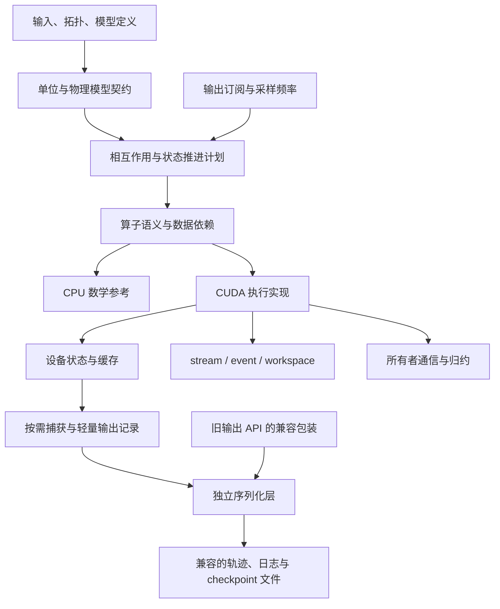

# 架构设计

状态：P0 设计基线。首个后端为 CUDA；实际 MD 功能按里程碑实现。

## 1. 边界与依赖

新引擎独立管理状态、相互作用、执行与通信，不继承旧引擎运行时接口。
输入转换与结果比较属于外围工具；不在每个时间步往返转换旧 `System`。
旧引擎继续提供行为对照，解析参考和外部引擎数据保留独立来源。
后续通过按需输出记录和独立序列化层复用当前 GMD 的输出协议及兼容入口，
旧 `System` 桥接仅作为可选过渡路径，详见第 7 节。



图表示职责关系，不要求运行时构造通用图解释器。第一阶段用静态明确的
调用序列承载依赖；同一数学算子可以融合进一个 kernel，也可以拆成多个。
不按单原子或单边进行虚函数分派。

## 2. 模块职责

以下是规划边界。除 reference、CUDA probe 及 P1.1 的 model 主机契约
（`include/gmd_next/core`、`include/gmd_next/model`）外尚未实现。

| 模块 | 持有或负责 | 不负责 |
|---|---|---|
| model | 单位、势参数、截断、排除、拓扑、请求的观测量 | 指定 block 大小或显存布局 |
| storage | 设备常驻位置、速度、力、质量、类型、全局 ID 和分区元数据 | 决定势函数 |
| relations | 半表/全表、CSR、超边、容量、有效性版本 | 隐式修改物理 cutoff |
| operators | Gather、几何、局部导数、聚合、装配、归约的语义 | 强制物化中间张量 |
| potentials | LJ、bonded、EAM、PME 各自的有依赖计算序列 | 改变外层时间步语义 |
| runtime | CUDA device、stream/event、workspace、能力和错误状态 | 隐式 CPU 回退 |
| integrators | kick/drift、力有效性、后续约束与热浴/压浴阶段 | 直接依赖旧 `System` |
| communication | owned/ghost、迁移、halo、反向装配、全局归约 | 假定本地槽位就是全局身份 |
| io | 输出订阅、按需记录、轨迹、checkpoint、运行元数据 | 每步强制取回完整状态或构造旧 `System` |

## 3. 状态与身份

- 初始设备布局采用 SoA：`x/y/z`、`vx/vy/vz`、`fx/fy/fz` 分开存储。
  语义层只要求形状与访问规则；之后是否改 AoSoA 由测量决定。
- 全局原子 ID 使用 64 位稳定整数。本地索引随排序、迁移而改变；GPU
  初期可使用有容量检查的 32 位本地索引，边数和字节大小计算使用足够宽的类型。
- owned 原子和 ghost 原子明确分区。只有 owned 项进入动能、温度等全局
  统计；ghost 力经反向通信归还，避免重复统计。
- 区分 `HostSnapshot`、`DeviceState` 与只读/可写 device view。view 不拥有
  数据，携带长度、设备身份和布局约定；不得把设备地址当作可解引用的主机 span。
- `DeviceState` 拥有缓冲区，单步执行持有其有效视图。重排、扩容或迁移
  使相关视图/关系失效；复用前重新绑定。
- 坐标、盒、拓扑、排列及分区分别具有版本。缓存的力必须匹配当前坐标、
  盒和模型版本；邻居缓存记录构建时状态、skin、覆盖半径与容量。

CPU 参考 API 仅消费主机上的坐标与显式关系，没有权威模拟状态。
其 `size_t` 下标只表示本次快照中的槽位，不是上述全局 ID。

## 4. 执行与资源生命周期

一个执行上下文绑定一个 CUDA device，拥有显式 stream、完成事件和可复用
workspace。初期单 stream 保证阶段顺序；增加多 stream 后以 event 建立依赖。

设计中的提交接口遵循：

```text
submit(context, input_views, output_views, workspace, prerequisites)
    -> completion + status
```

此处是契约示意。P1.2 的 `Context`/`Completion`/`DeviceBuffer`/`Workspace`
实现了其中的资源与完成部分（代码已写，待 GPU 验收），`submit` 本身尚无实现。`completion` 完成之前，所有相关缓冲区、
参数和 workspace 都必须存活，且不能被冲突的调用复用。设备端错误标志也
属于完成状态；launch 成功不等于计算成功。host 输出只能读取已完成的快照。

capacity 预留和 workspace 查询放在初始化或重建阶段；正常力计算不反复
分配释放。CUB scratch 在同一 stream 顺序内可复用；不同 stream 必须使用
独立 scratch 或显式等待。先完成正确执行，再考虑 CUDA Graphs 捕获稳定路径；
重建、迁移与扩容使捕获计划失效并重新建立。

## 5. 单步流程

初始化：输入校验 → 单位转换 → 设备上传 → 构建关系 → 计算 `F0`。
每步开始前合并动力学与输出订阅所需的观测量，并在对应时间层捕获；
仅输出需要的 U/W 可以按采样频率求取，动力学本身所需的量不能省略。

```text
kick(h/2) → drift(h) → 更新周期状态/位移界
    → [需要时重建关系并检查容量]
    → 当前几何 → Potential(U, F, W)
    → kick(h/2) → [按需观测/输出]
```

热路径的位置、速度和力常驻设备。允许用明确的小型状态同步决定邻居重建，
首版不要求所有控制逻辑都在 GPU。容量不足时本次力结果不可使用；扩容重建后
重算力，不能再次执行已经完成的 drift。

未来多 GPU 流程将迁移、前向 halo 和反向装配加入相应依赖边。EAM 还需处理
密度及嵌入导数的跨分区依赖，不能套用只有一次坐标 halo 的 LJ 流程。
PME 与约束分别增加场算子和耦合求解节点。

## 6. 当前决定与保留事项

已确定：独立构建、CUDA 首后端、CPU 数学参考、双精度先行、显式数据所有权、
半表语义先行、算子允许融合、正确性和性能分别验收。

待目标 GPU 实测后决定：具体 SM 架构、Toolkit 固定版本、block 配置、半表
原子累加与全表本地收集的选择、混合精度、多 GPU 传输方式。没有这些数据
不会阻止接口设计；也不提前承诺性能或跨 GPU 逐位重复。

## 7. 与现有输出接口相接

状态：设计已优化，输出记录、序列化提取及 GPU 输出路径均尚未实现。

以输出订阅声明字段、频率和时间层，执行计划提前准备所需观测量，在各自
有效的时刻捕获。基础算子不直接调用 writer，设备布局不服从文件格式。

```text
输出订阅 + 动力学需求 → 本步计算与捕获计划
    → 设备结果 → 按需打包/下载 → 只读输出记录
    → 独立序列化层 → 当前文件格式与下游工具
旧输出 API → 兼容包装 → 同一序列化层
```

### 7.1 连接边界

| 接口或记录 | 优化后的职责 | 兼容边界 |
|---|---|---|
| `ThermoRecord` | 固定大小的热力学量、有效性和采样时刻 | 可单独写 `.log`，无需下载坐标 |
| `TrajectoryFrameView` | 按稳定身份排序的坐标只读视图、类型及帧头 | 保留 `.xyz` 字段与坐标/热力学时间层约定 |
| `RestartRecord` | 完整重启状态和所引用模型元数据 | 独立版本、完整性检查和续跑验收 |
| 旧 `TrajectoryWriter` / checkpoint API | 保留调用入口，包装为上述记录后序列化 | 旧入口的联合写入、格式和默认行为保持兼容 |

这些名称仅表示设计中的数据契约。详细字段、同步依赖、过渡路径和性能验收
见[输出层设计](output_pipeline.md)。

### 7.2 实施约束

- 序列化层只接受主机只读数据视图和已明确的单位/时间层，不依赖旧 `System`
  或 CUDA。新输出路径直接消费记录，避免主机快照再复制为完整旧状态。
- 旧 API 的序列化提取属于后续有回归验证的 I/O 改造；本轮仅修改设计文档。
  可选旧 `System` 桥接留在仓库外围集成目标，仅用于先期兼容检查。
  `next/` 核心继续不包含 `gmd/*`、不链接 `gmd_core`，并可独立构建。
- 首版以同步捕获建立正确基线；按字段下载、静态元数据复用和独立日志频率
  从首版实现。异步打包、下载及写入在测量后引入，不承诺零拷贝或必然重叠。
- 保持已有单位、稳定 ID、压力有效性与完成步记录语义；checkpoint 独立验收。
  输出消费者不重复求力、扫描全量速度或执行全局归约。
