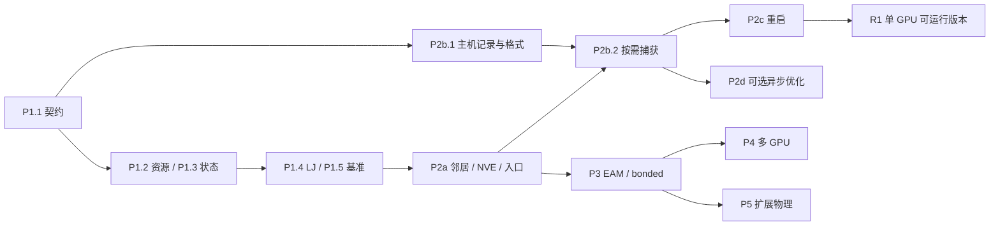

# 程序实施规划

状态：规划完成。已实现 P0 CPU 参考、CUDA/CUB 环境探针、P1.1 主机契约
（`GMDNext::contracts`，CPU 验证）与 P1.2 CUDA 资源代码（`GMDNext::cuda_runtime`，
**未经 nvcc 编译、未在 GPU 运行**），见[验证记录](verification.md)；其余新增
模块、接口和任务均未实现。本文件不代表 GPU 运行或性能验证通过。

本计划将[架构](architecture.md)、[算子契约](operator_contracts.md)和
[输出设计](output_pipeline.md)落实为文件职责、开发任务、依赖与验收。
[路线图](roadmap.md)保留 P0–P6 的总览；任务状态以后按实际证据更新。

## 1. 实施目标与首个交付范围

首要目标是优化整个 MD 时间步：联合设计设备状态、相互作用组织、融合执行
和按需输出。CUDA 是首个实际后端；算子语义保留扩展能力，但初期不搭建通用
图解释器、跨平台编译器或所有硬件后端。性能测量贯穿各阶段，不推迟到 P6。

首个可交付版本 R1 对应 P1、P2a、P2b、P2c 完成：

| 范围 | R1 交付边界 |
|---|---|
| 执行 | 单进程、单 NVIDIA GPU、FP64，显式 CUDA 执行上下文 |
| 物理模型 | 单类型 LJ、统一 epsilon/sigma、有限 cutoff；显式选择 potential-shift 或 force-shift |
| 几何 | 固定正交盒、三维周期，`skin > 0` 且 `rc + skin < min(L)/2`；最近镜像与连续位移追踪 |
| 动力学 | Velocity Verlet NVE，输入确定的位置、正质量与显式速度；可选择初始去质心并记录 DOF |
| 输入 | 新入口读取受支持的 `.run/.xyz/.ff` 子集及带 ID/单位的速度输入，生成规范化模型；未知或未消费字段拒绝 |
| 输出 | 分别采样的兼容 XYZ/日志，完整帧头、单位与压力有效性；旧联合频率模式保留 |
| 恢复 | next 自身读回与续跑；在共同支持的模型/参数范围内验证旧 checkpoint 互通 |
| 性能证据 | 无输出、标量、轨迹和 checkpoint 的分项成本与完整时间步结果 |

R1 不承诺随机速度初始化、多类型混合、键合项、EAM、约束、长程静电、NPT
或多 GPU。P1 保留显式边缩放的静态算子测试；动态运行对未实现的排除/缩放
配置明确报错，不将其当作已支持功能。无 cutoff/非周期静态情况仍可用于参考
及算子检查，不进入 R1 周期邻居构建路径。

旧 LJ 的兼容比较使用 potential-shift；force-shift 是独立模型选择。旧入口或
旧 checkpoint 不能表达的模型设置须拒绝，不靠替换 cutoff 约定实现“互通”。

## 2. 代码模块与构建边界

以下路径是实现目标，只在对应任务开始时创建；不预先生成空模块。

```text
next/
  include/gmd_next/
    core/          状态版本、ID、单位、有效性、错误与需求类型
    model/         RunSpec、LJModel、CellSpec、模型校验
    runtime/       不暴露 CUDA 类型的执行上下文与完成状态接口
    storage/       HostState、DeviceState 所有权接口与设备视图
    relations/     半表视图、NeighborState、容量与有效性结果
    operators/     Gather/几何/装配/归约语义与融合实现入口
    potentials/    势函数计划及 ForceRequest/ForceResult 契约
    integrators/   Verlet 阶段及步提交状态
    io/            捕获请求、输出调度与缓冲区所有权接口
    reference.hpp  已有 CPU 数学参考，保持独立 oracle 职责
  src/
    core/ model/   主机校验、单位与版本规则
    io/            输出计划、捕获协调、队列与运行元数据
    reference.cpp  已有参考实现
  backends/cuda/
    runtime/       device/stream/event、buffer、workspace、错误处理
    storage/       上传、视图绑定、排序与状态缓冲区
    operators/     可复用局部函数、归约、打包等 CUDA 实现
    potentials/    融合 LJ、后续 EAM/bonded 计算序列
    relations/     cell 分组、候选计数/填充、重建与容量处理
    integrators/   kick/drift、位移追踪、观测量
    probe.cu       已有独立环境探针
  io_codec/
    include/gmd_next/io_codec/  纯主机只读记录和序列化入口
    src/                       XYZ、日志、checkpoint 格式代码
    CMakeLists.txt             可单独引入的纯 C++ 子项目
  app/              reference_demo、后续 gmd_next / gmd_next_benchmark
  tests/            CPU 契约、GPU 算子/动力学、I/O 与端到端测试
  examples/         经验证的 LJ 静态、NVE、重启运行输入
  benchmarks/       负载配置、采集脚本与结果说明
```

`gmd_next` 是新代码命名空间；序列化可使用 `gmd_next::io_codec`。共享记录只
含标准 C++ 类型与显式单位/版本，不依赖旧 `System` 或 CUDA。设备原始地址
只用于设备视图，不能借主机 `span` 表示可读取的设备数组。

| 规划目标 | 依赖与职责 |
|---|---|
| `GMDNext::contracts` | 主机/设备可共享的基础契约；不链接硬件或旧引擎 |
| `GMDNext::reference` | 已有 CPU oracle；新增独立物理检查，生产执行不回退到此目标 |
| `GMDNext::cuda_runtime` | contracts + CUDA Runtime；资源所有权与完成状态 |
| `GMDNext::cuda_md` | runtime + CUB；设备状态、关系、势计算与积分实现 |
| `GMDNext::io_codec` | 标准 C++ 序列化子项目，无引擎状态/硬件依赖 |
| `GMDNext::io` | 输出调度与记录；CUDA 捕获部分由后端实现，避免 CPU 格式测试依赖 GPU |
| `gmd_next` | 输入校验、运行编排、状态汇报与显式失败；只在实际后端可用时执行 MD |
| `gmd_next_benchmark` | 静态力/完整步/输出测量；记录配置与环境，不链接旧引擎作为执行核心 |

目录划分不要求每个算子成为单独静态库。当前 CMake 的 CUDA 开关只构建探针；
实现 GPU 目标时再更新开关说明和测试注册，不能提前把探针解释成 MD 功能。
现有 CPU 用 C++20，探针用 CUDA C++17；P1.2 必须明确新 CUDA 目标标准及
共享头文件边界，并在固定工具链上编译验证，避免无意把主机专有类型带入 kernel。

旧 writer 的共享格式提取属于 P2b 的独立 I/O 改造：旧 API 包装 `io_codec`，
旧调用签名与默认输出行为不变。只按需引入 `next/io_codec` 子项目，不把整个
`next/` 加入父项目构建。实施该任务时须核对受影响目录规则并运行旧输出回归；
旧力计算、积分流程及物理基线不随此任务修改。本轮不修改任何构建或旧源码。

可选旧 `System` 过渡桥接仅位于外围 `integration/legacy_output/`；它不是
新运行时的一部分，也不能成为 R1 性能验收的最终输出路径。

## 3. 先稳定的数据与调用契约

类型名称为设计草案，可随实现评审调整；职责和生命周期不能隐式变化。

| 契约 | 必须携带的信息 | 所有权/有效性 |
|---|---|---|
| `RunSpec` / `LJModel` | 单位、dt、步骤、盒、参数、cutoff 模式、skin、输出请求 | 主机校验后冻结；模型更改使相关计划失效 |
| `HostState` | 稳定 64 位 ID、类型、质量、位置、速度、盒、时间及初始化策略 | 明确拥有输入；上传后不作为每步权威状态 |
| `DeviceState` / views | SoA X/V/F、质量/身份、周期追踪、容量、device 与状态版本 | backend 持有缓冲区；重排/扩容后重新取得 views |
| `NeighborState` | 半表、逻辑长度/容量、构建位置、skin、模型/盒/排列版本 | 候选覆盖证明与 overflow 状态均需有效 |
| `ForceRequest` | 必需 F、按需 U/W、精度和覆盖/累加约定 | 每步合并物理需求及所有到期输出/格式依赖 |
| `ForceResult` | 设备 F 与可选 U/W、坐标/盒/模型版本、局部/全局范围 | completion 成功且版本匹配后可消费；未请求的量标记缺失 |
| `Completion` / status | 执行身份、前置事件、库/kernel/设备错误、可恢复容量状态 | 提交成功不等于完成成功；关联资源在完成前存活 |
| 输出 records | 热力学标量、轨迹视图或重启状态，以及各自采样阶段 | 捕获层拥有槽；消费者持有只读租约直到写入完成 |

规划调用链，不是可调用 API：

```text
validate(input) → RunSpec + HostState
create_context / reserve → upload → prepare_relations → evaluate(F0)
plan_step(dynamics, subscriptions, format_dependencies)
    → kick → drift → validate_or_rebuild_relations
    → evaluate_force(request) → kick → capture_requested_records
    → check_status / commit_step → publish_ready_records
drain_output → finish_report
```

首版关系/计算错误可通过小型状态下载检查。容量不足仅重试当前几何上的构图
和力计算，不重复 drift；非法状态导致停止，不提交新 step 或发布该步记录。
这不是自动回滚承诺。后续减少主机同步时必须保留等价的错误与提交顺序。

## 4. 实施任务与依赖

下面每行是一个可独立评审的任务；大任务按其验收边界再拆提交。
除 P1.1（完成）与 P1.2（代码已写，待 GPU 验收）外，全部新增任务当前为未实现，
P0 不重复搭建。

| 任务 | 依赖 | 实现内容 | 退出条件 |
|---|---|---|---|
| P1.1 基础契约（**已实现，CPU 验证**） | P0 | core/model 类型、输入校验、单位、ID/版本、请求与缺失值规则 | 非法配置、未消费字段、溢出/单位/版本错配明确失败；已有参考检查保持有效 |
| P1.2 CUDA 资源（**代码已写，待 CUDA 机编译/运行验收**） | P1.1 | 执行上下文、可移动 buffer、stream/event、workspace 与错误传播 | 固定 CUDA 机编译/运行；重复使用、设备不匹配、扩容失效与失败清理检查 |
| P1.3 设备状态 | P1.2 | SoA 上传、质量与身份、views、按字段下载 | 往返值/顺序正确；容量稳定时不按步分配；无隐式旧 `System` 转换 |
| P1.4 融合 LJ | P1.3 | 显式半表上的几何/势导数/端点装配；CUB 能量/维里归约 | 独立梯度/维里与 CPU 对照；cutoff、缩放、空表、奇异输入及输出掩码正确 |
| P1.5 静态性能基线 | P1.4 | 固定关系 benchmark、GPU/编译配置与分项计时 | 记录冷/热运行、scratch/中间量内存、规模与误差；不预设加速比 |
| P2a.1 邻居关系 | P1.4 | cell 分组、count/scan/fill 半表、skin 和连续位移追踪 | 小系统与全对枚举比较集合；周期 cell 重复访问去重；强制 overflow 后扩容重算正确 |
| P2a.2 NVE 推进 | P2a.1 | F0、kick/drift、关系重用、完成步统计与错误提交边界 | 单步对照、跨盒、步长收敛/能量行为；失败不重复推进 |
| P2a.3 可运行入口 | P1.1、P2a.2 | 受限输入解析、规范化状态、CLI、示例、运行元数据 | 从确定输入完整运行，未支持模型明确拒绝；有无观测输出不改变物理语义 |
| P2b.1 记录与格式 | P1.1 | 纯主机 records、共享 codec、旧 API 包装与同步 writer | 同一主机状态的旧/新格式对照；压力、单位、顺序及已有读取脚本通过 |
| P2b.2 按需捕获 | P1.3、P2a.2、P2b.1 | 订阅并集、独立频率、缓存元数据、同步捕获 | 标量日志无原子数组下载，轨迹帧头完整；新路径不构造旧 `System` |
| P2c 恢复闭环 | P2a.3、P2b.2 | 完整 NVE 快照、checkpoint 编解码、恢复时重建关系/力、提交失败处理 | next 连续/分段运行与共同模型下旧接口互通；不支持的状态明确拒绝 |
| P2d 输出重叠 | P1.5、P2b.2，checkpoint 异步另需 P2c | 按瓶颈引入打包、pinned 池、copy stream、有界队列 | 所有权/慢消费者/失败测试；同负载对照包含最终排空与额外显存成本 |
| P3.1 EAM 参考与模型 | P1.1 | 独立 CPU EAM、密度方向、嵌入、参数表/插值和边界契约 | 单元素及非对称多元素梯度/维里检查；构造函数与材料参数验证分开 |
| P3.2 GPU EAM | P3.1、P2a.2 | 密度归约 → 嵌入导数 → 边导数 → 力/维里；比较几何缓存与重算 | 依赖链和数值正确；记录各阶段及整体吞吐量；不把嵌入项当独立 pair |
| P3.3 bonded 与模型组合 | P2a.2，局部参考先行 | 键/角/二面角有序超边、拓扑镜像、多类型 LJ 参数对表及混合/覆盖规则、非键排除/缩放、贡献合并 | 局部梯度与 virial、角色/镜像正确；组合势只清零一次且不重复计数 |
| P4 多 GPU | P2a–P2c、待分布模型的 P3 任务 | 分区/迁移、owned/ghost、halo、反向装配及 EAM 附加交换 | 单/多设备与空分区；全局 ID/总量、跨域关系和 EAM 阶段完整 |
| P5 扩展物理 | 对应已验证势/积分/输出；不强制等待 P4 | PME、约束、热浴/压浴分别立项 | 每项独立物理参考、时间层与恢复契约；不能按一个“通用扩展”验收 |
| P6 发布收敛 | 所发布能力对应阶段 | 配置固定、基准包、使用/错误文档、可复现构建与能力清单 | 只声明已验证的平台和模型，性能报告与可复现输入对应 |

P2b.1 可以用主机 fixtures 提前开发，不依赖 GPU 积分完成；P2d 依实测收益
决定，不阻塞 R1 或 EAM 正确性工作。先用 EAM 检验多阶段算子组织，再扩展
更广的势函数覆盖。实际材料 EAM 文件导入和参数有效范围需单独验收，解析
玩具函数通过不能作为材料模拟已支持的证据。



## 5. 性能优化按证据推进

初始算法采用 SoA、显式半表、FP64 原子装配、融合 LJ 与可复用 workspace。
这些是可验证起点，不是所有负载下最优的结论。以下优化每次只引入可定位的
机制，并保留对照版本或开关用于比较：

| 测量发现 | 候选优化 | 必须计入的代价 |
|---|---|---|
| 小算子间读写/启动成本高 | 融合局部计算、减少中间张量、稳定路径的图捕获 | 寄存器/占用、错误与重建路径、捕获维护 |
| 力装配争用 | 全表本地收集或分组归约，与半表原子实现比较 | 重复势计算、排序、额外关系/临时内存、计数规则 |
| 邻居访问/负载不均 | 粒子和边重排、cell 布局、分块与任务粒度调整 | 重排与映射成本、关系失效、输出顺序恢复 |
| EAM 两轮几何读写较大 | 缓存距离/局部量或重新计算 | 显存占用、带宽、重新计算成本与密度阶段依赖 |
| 输出阻塞计算 | 按字段合并、静态缓存、同步/异步路径选择 | 打包、D2H、队列等待、格式化、文件写入和末尾排空 |

每个 GPU 阶段同时报告正确性、耗时和内存。至少使用多个系统规模与邻居
密度，记录 rc/skin、重建频率、输出频率、精度和硬件。完整步基准包含邻居
维护和积分，力 kernel 单独计时另列。对比当前 GMD 用于行为检查；性能还需
选择实际支持同一模型的成熟 GPU 实现，匹配参数、精度与误差要求后比较。
不预设“至少加速几倍”，未测量的优化只标为候选。

## 6. 验证与交付记录

- **主机层：** 输入契约、单位/时间层、稳定 ID/版本、CPU 数学参考、记录与
  格式、调度需求及 checkpoint 编解码；能在无 CUDA 环境完成。
- **设备层：** 固定工具链编译、GPU 数值与错误、容量重试、事件/缓冲区寿命；
  CUDA 测试单独标记，没有设备时保持“未验证”，不能用参考路径代替通过。
- **物理层：** 解析例子、能量有限差分、应变维里、守恒条件、步长收敛和
  可恢复运行；不能只比较两个共享同一推导实现的函数。
- **接口层：** 旧输出包装的现有压力/时间单位、轨迹及 checkpoint 回归；格式
  提取必须验证原入口，GPU 路径按明确容差而不是任意放宽阈值判断。
- **系统层：** 无输出/不同输出频率、重建与 overflow、错误中止、退出排空、
  内存稳定性、输入与运行元数据可追溯，形成 R1 能力清单。

测试随会改变行为的任务添加，不为目录、简单转发或 getter 单独扩充测试。
每项完成记录实现提交、输入/配置、构建环境、实际检查结果与尚未覆盖部分；
性能数据附原始结果和重跑命令。测试数据应携带来源，不改旧物理基线迁就新实现。

## 7. 当前可执行的第一批工作

本次环境检查为 Darwin arm64，PATH 中未找到 `nvcc` 和 `nvidia-smi`。
这限制 GPU 编译/运行验收，不阻止主机契约、参考、格式与输入工作。

1. **P1.1 已完成（CPU）：** 基础类型、模型/单位校验、规范化输入与观测需求
   契约已实现，reference API 未改动；实际范围与限制见本文第 8 节。
2. **P1.2 代码已写（第 9 节），验收待目标机；接着实现 P1.3：** 在明确 CUDA
   开发机、GPU/SM 和工具链后完成验收及设备状态。无需现在决定最优 block 大小。
3. **形成 P1.4–P1.5 的闭环：** 显式半表 GPU LJ、独立数值检查、静态性能和
   内存记录。完成后再接动态邻居和积分，便于定位物理与执行错误。
4. **无 GPU 时继续 P2b.1 的主机部分及 P3.1 独立参考：** 记录/格式 fixtures
   与 EAM 数学检查可先推进，GPU 状态保持未验证，不冒称已完成完整阶段。

本规划不设置缺少人员和硬件依据的日历工期；按任务退出条件交付。R1 完成后
以端到端性能结果决定优化优先级，再推进多体势与更大范围的系统能力。

## 8. P1.1 实现记录

状态：已实现，仅经 CPU 检查（2026-09-21，见[验证记录](verification.md)）。
构建目标 `GMDNext::contracts`，不依赖 CUDA、旧引擎或 `GMDNext::reference`；
参考 oracle 同样不依赖它，两者只在测试中手工映射比较。

| 头文件 | 契约 |
|---|---|
| `core/identity.hpp` | `AtomId`（64 位，负值表示无身份）；`LocalIndex`（32 位槽位，`from_size` 超出容量报 `capacity_overflow`） |
| `core/version.hpp` | 坐标/盒/模型/排列四个按类型区分的版本；`VersionStamp`、`StateVersions`、`check_versions`；未设置的版本从不匹配；`kCachedForceDomains` 与 `kNeighborListDomains` |
| `core/status.hpp` | `ErrorCode`、`Diagnostic`、汇总全部问题的 `ValidationReport`、`ContractError`；`Availability` 三态与 `Quantity<T>`，非有限值存为 invalid，缺失值写出为 NaN |
| `core/units.hpp` | `UnitSystem{metal, reduced}`、`TimeUnit`；fs↔内部时间、eV/ų↔bar 换算及常数来源；reduced 单位换算到 fs/bar 被拒绝；`StepStamp` |
| `core/observables.hpp` | `ObservableSet`、`SamplingStage`、`Accumulation`；`ObservableRequest` 分开动力学需求与仅输出需求，只合并同阶段、同累加方式的请求；`ObservableRecord` 未请求量保持 unavailable，写入未请求量报错，携带版本与采样阶段 |
| `model/lj_model.hpp`、`cell.hpp` | 单类型 `LjModel`（ε、σ、cutoff 模式、cutoff、skin）；固定正交 `CellSpec` |
| `model/host_state.hpp` | `HostState` 输入；`NormalizedState` 按稳定 ID 升序、记录输入行映射、边界处一次换算起始时间，可选去除质心动量并记录 DOF（3N 或 3N−3） |
| `model/run_spec.hpp`、`validate.hpp` | `RunSpec`、`Ensemble`（nvt/npt 明确拒绝）；`ValidationScope::reference_static` 与 `production_r1` 分开校验；`ValidatedRun` 为唯一规范化入口，`force_request()` 对 NVE 只要求力，能量/维里仅在输出请求时加入 |

范围说明：

- “未消费字段”在契约层的含义：cutoff 模式为 none 时 cutoff 必须为 0；静态
  参考范围 skin 必须为 0；`types` 只接受单一类型 0；nvt/npt、reduced 单位、
  非全周期盒在生产范围明确拒绝。输入文件中的未知键由 P2a.3 解析器负责，尚未实现。
- 生产范围要求 metal 单位、NVE、有限 cutoff、`skin > 0`、三轴周期且
  `rc + skin < min(L)/2`、至少一个原子及显式速度；去质心时至少两个原子。
  数值容限未放宽：阈值处严格拒绝。
- FP64 是唯一精度，未设精度选项；`Accumulation` 目前只约束请求合并，
  由 P1.4 装配实现消费。
- 未实现：设备状态、CUDA 资源、邻居构建、积分、输入解析、输出记录/writer。
  `ObservableRecord` 中的力只有可用性，没有主机数据；设备载荷由 P1.3/P1.4 定义。

## 9. P1.2 实现记录

状态：代码已写；主机簿记部分经 CPU 检查；CUDA 部分**未经 nvcc 编译、未链接、
未在 GPU 运行**，退出条件尚未满足（2026-09-21，见[验证记录](verification.md)）。

**语言与头文件边界。** 新 CUDA 目标使用 CUDA C++20（CUDA 12.0+ 与支持 C++20
的主机编译器），以便 `.cu` 共享 contracts 头文件；探针保持 C++17。公共头
`backends/cuda/include/gmd_next/cuda/runtime.hpp` 不含任何 CUDA 类型；stream 等
原生句柄只经后端内部的 `backends/cuda/runtime/native.hpp` 提供给 `.cu`。
kernel 只接收原始设备地址和长度，不在设备代码中使用 `Quantity` 等主机类型。

| 位置 | 内容 |
|---|---|
| `include/gmd_next/runtime/`（contracts，CPU 测试） | `DeviceId`；不可在主机解引用的 `DeviceSpan<T>` 与 `BufferIdentity`；`CapacityTracker`（1.5 倍几何扩容、溢出检查、重分配或尺寸变化即使旧 view 失效）；`CompletionState`/`CompletionStatus`；`DeviceFault` 位及解码（未知位报错）；`CompletionLedger` |
| `backends/cuda/runtime/`（`GMDNext::cuda_runtime`） | `Context`：一个设备、一个非阻塞 stream、一个完成事件、一个设备状态字及其 pinned 回读槽；要求 sm_60+ 与流序内存池，否则明确拒绝 |
| 同上 | `Completion`：`query`/`wait`；设备故障位使完成失败但上下文仍可用（容量不足可重试）；运行时错误使上下文失效；未解决即析构时等待，故障不会丢失 |
| 同上 | `RawBuffer`/`DeviceBuffer<T>`：只可移动，`cudaMallocAsync`/`cudaFreeAsync` 在上下文 stream 上排序；`Contents::discard/preserve`；容量内调整不分配；OOM 报 `allocation_failed` 且缓冲区与上下文保持原状；按 `size()` 精确上传/下载 |
| 同上 | `Workspace`：只增不减的 CUB scratch，绑定上下文 stream |

首版限制：每个上下文同时只允许一个未解决的 completion（单一回读槽）；非线程
安全，一个主机线程驱动一个上下文；跨 stream 使用 workspace 须显式事件依赖，
本任务未提供；上下文失效后需新建上下文，不自动恢复。GPU 测试
`gmd_next.cuda_runtime` 仅在 `GMD_NEXT_TEST_CUDA=ON` 时注册。
